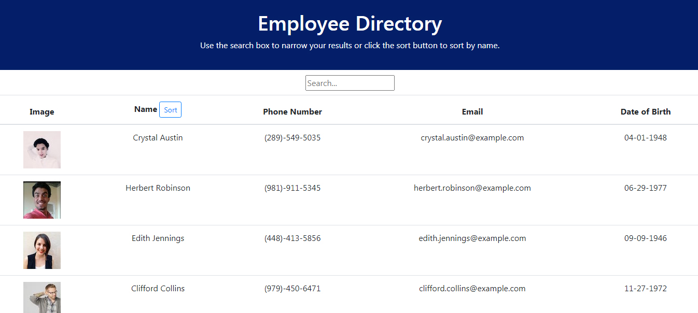
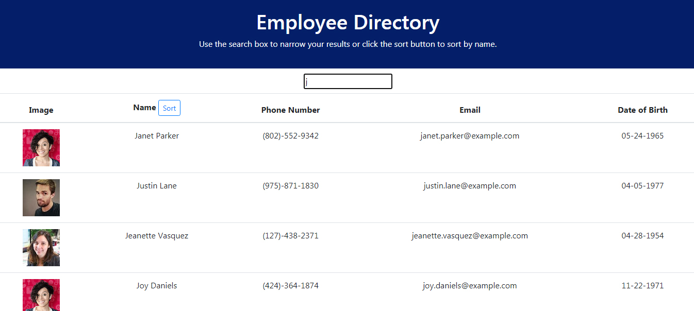
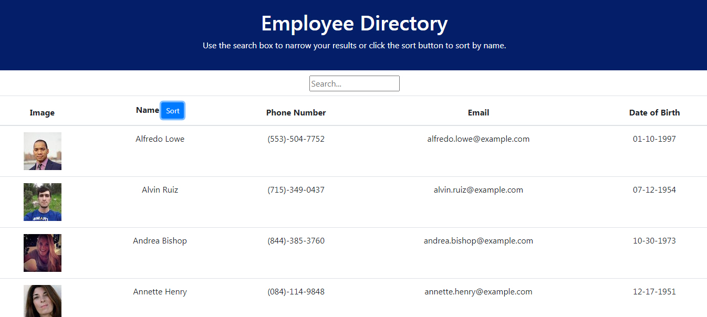
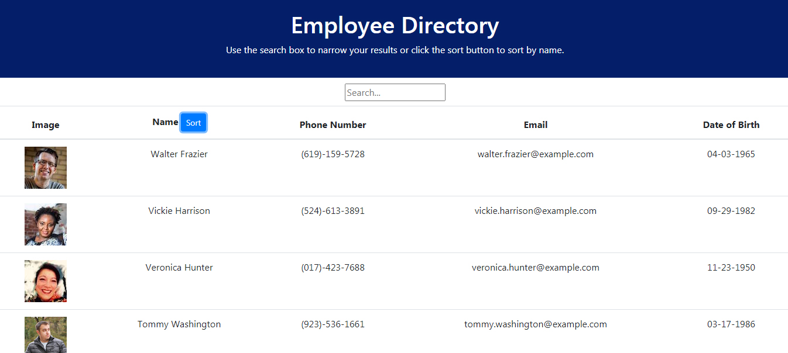

[Link to my Portfolio, featuring my lastest apps](https://anaiva27.github.io/My-portfolio/portfolio.html) <br>
[Link to the deployed app](https://anaiva27.github.io/Employee-directory/)

# Employee-directory


## Table of Contents

- [Description](#Description)
- [Installation](#Installation)
- [Usage](#Usage)
- [License](#License)

## Description

This application gives users access to an employee directory and allows to search throught it and sort the results by name in alphabetical order. The user interface is built with one of the most popular libraries - React JS and includes several components that pass data received from an API. The project introduces a simple intuitive interface and has been developed using a variety of technologies and programming languages such as JavaScript, JSX, HTML, CSS, API requests, and Node.js.
<br>

## Installation

Employee directory application is deployed on GitHub pages and compiled into a production build. The webpage can be accessed by following the link at the top of the page.
To run this application on a local machine, the user will need to install Node.js and MongoDB, then initialize the folder containing the application by typing `npm init -y` and `npm i` in the command line to install required dependencies. The `package.json` will hold various metadata that's relevant to the project.

```
npm i
npm axios
npm start
```

<br>

## Usage

When the user starts the application, the API call fetches information about random users from [randomuser.com](https://randomuser.me/api/?results=100&nat=us) object and is being sorted into 5 columns: image, name, phone number, email, date of birth. Under the header there's an input field, where the user can type in the name and find information about a specific user. The directory can be sorted by name in ascending or descending alphabetical orders.
<br>

<br>
Screenshots:<br>
Homepage: <br>

 <br>
<br>
Search for 'j', the user can also search for "J" and would get the same results: <br>

 <br>

Sort alphabetically in descenting order: <br>
 <br>
<br>

Sort alphabetically in ascenting order: <br>
 <br>
<br>

## License

Copyright © 2020 Anastasia Ivashchenko

    Permission is hereby granted, free of charge, to any person obtaining a copy of this software and associated documentation files (the "Software"), to deal in the Software without restriction, including without limitation the rights to use, copy, modify, merge, publish, distribute, sublicense, and/or sell copies of the Software, and to permit persons to whom the Software is furnished to do so, subject to the following conditions:

    The above copyright notice and this permission notice shall be included in all copies or substantial portions of the Software.

    THE SOFTWARE IS PROVIDED "AS IS", WITHOUT WARRANTY OF ANY KIND, EXPRESS OR IMPLIED, INCLUDING BUT NOT LIMITED TO THE WARRANTIES OF MERCHANTABILITY, FITNESS FOR A PARTICULAR PURPOSE AND NONINFRINGEMENT. IN NO EVENT SHALL THE AUTHORS OR COPYRIGHT HOLDERS BE LIABLE FOR ANY CLAIM, DAMAGES OR OTHER LIABILITY, WHETHER IN AN ACTION OF CONTRACT, TORT OR OTHERWISE, ARISING FROM, OUT OF OR IN CONNECTION WITH THE SOFTWARE OR THE USE OR OTHER DEALINGS IN THE SOFTWARE.
